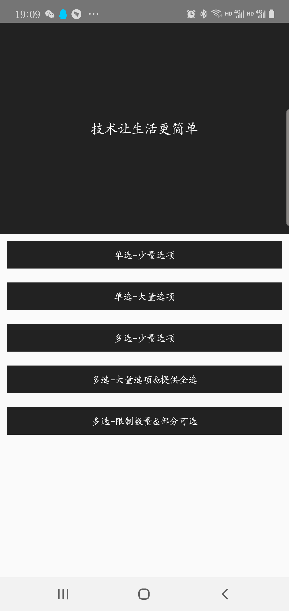
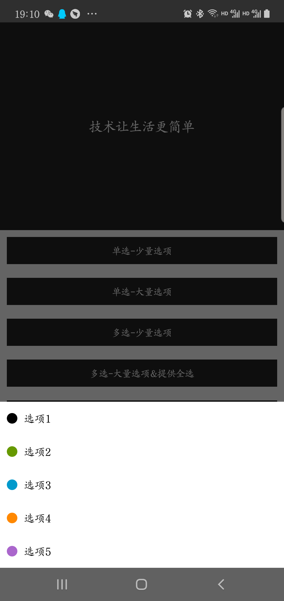
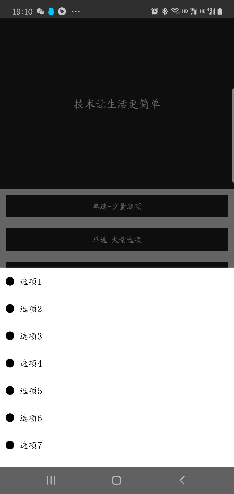
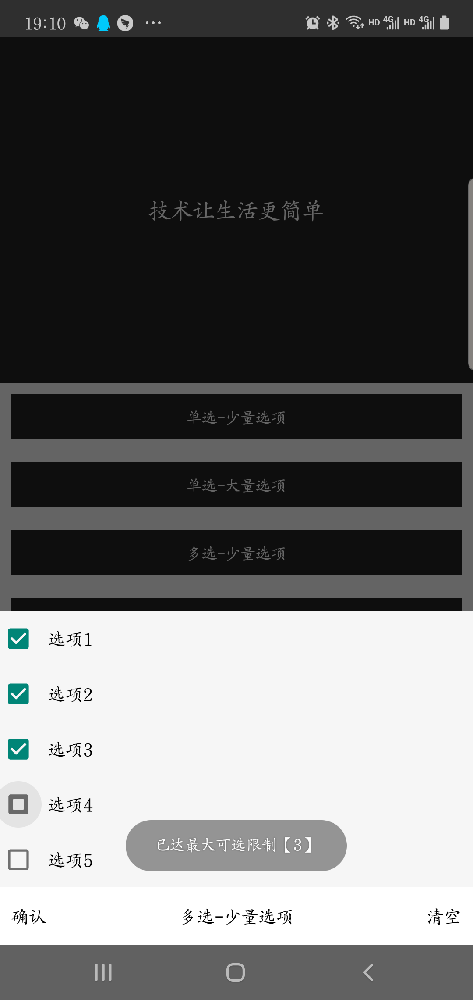
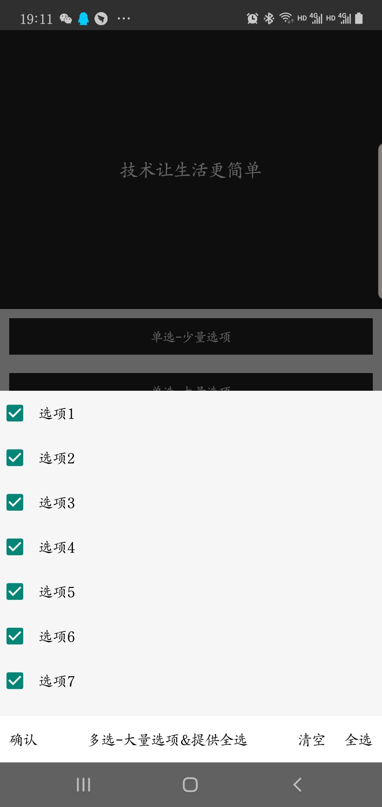
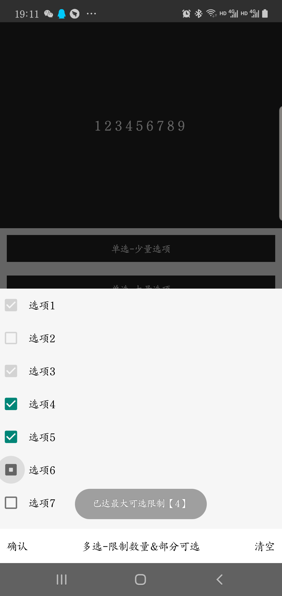

# 选项组件说明文档

当前版本 `lib-version`
 
[](https://www.jitpack.io/#hslooooooool/qsos-select)

引用:

```groovy
dependencies { 
    implementation 'com.github.hslooooooool:qsos-select:[lib-version]'
}
```

## 技术
- Kotlin
- AndroidX

## 说明
- 选项实体Operation解释
```kotlin
/**
 * @param key 选项名称
 * @param value 选项值
 * @param checked 是否选中
 * @param checkable 是否可选
 * @param iconId 选项图标
 */
data class Operation(
    val key: String,
    val value: Any = key,
    var checked: Boolean = false,
    var checkable: Boolean = true,
    @DrawableRes
    var iconId: Int? = null
)
```

- 单选

接口解释
```kotlin
    /**
     * @param operations 可选项
     * @param listener 选择结果回调-返回单选项
     * */
    fun selectOfSingle(
        activity: AppCompatActivity,
        operations: List<Operation>,
        listener: OnSelectListener<Operation>
    )  
```

具体调用方法
```kotlin
    SelectHelper.selectOfSingle(
        activity = this@MainActivity,
        operations = mOperations0,
        onTListener = object :OnSelectListener<Operation> {
            override fun select(data: Operation?) {
                select_picked.text = "${data.value}"
        }
    })
```

- 多选

接口解释
```kotlin
    /**
     * @param title 弹窗标题
     * @param limitMax 最大可选数，传<0表示不限制
     * @param operations 可选项
     * @param listener 选择结果回调-返回所有选项
     * */
    fun selectOfMultiple(
        activity: AppCompatActivity,
        title: String? = "多选",
        limitMax: Int = 0,
        operations: List<Operation>,
        listener: OnSelectListener<List<Operation>>
    )
```

具体调用方法
```kotlin
    SelectHelper.selectOfMultiple(
        activity = this@MainActivity,
        title = "标题",
        limitMax = 3,
        operations = mOperations2,
        listener = object :OnSelectListener<List<Operation>> {
            override fun select(data: List<Operation>) {
            select_picked.text = ""
            data.forEach { o ->
                if (o.checked) {
                    select_picked.append("${o.value}\t")
                }
            }
        }
})
```

## 截图





